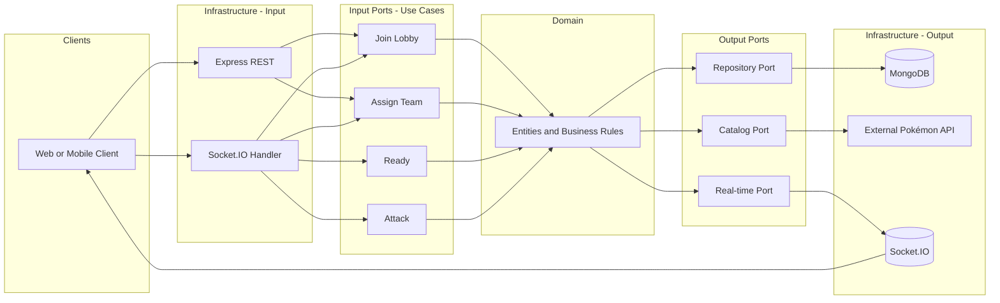

# Backend Architecture — PokePVP

This document describes the backend architecture: **hexagonal (ports and adapters)**, **event-driven** communication, **Clean Code**, and **SOLID** principles. The backend is built with **Express**, **MongoDB**, and **Socket.IO** for real-time communication.

---

## 1. Context and Constraints

- **Runtime:** Node.js 18+
- **Web framework:** Express
- **API:** REST for catalog/health; real-time for lobby and battle via **Socket.IO**
- **Database:** MongoDB (non-relational)
- **Server:** Must run locally on **port 8080** and listen on **0.0.0.0**

---

## 2. Hexagonal Architecture (Ports and Adapters)

The core of the application is the **domain**; all external concerns (HTTP, WebSockets, database, external APIs) are accessed through **ports** (interfaces) and **adapters** (concrete implementations).

### 2.1 Domain (Core)

- **Entities**, **value objects**, and **business rules** live here with **no dependency** on Express, MongoDB, or any transport.
- **`domain/ports/`** — Output port interfaces (e.g. `CatalogPort`, `LobbyRepository`). The domain defines the contracts it needs; infrastructure implements them. This follows the inversion of dependency principle.
- All battle, lobby, and team rules are implemented in the domain (or application layer that uses the domain). See [business-rules.md](business-rules.md) for the canonical rules.
- The domain does **not** import frameworks or infrastructure.

### 2.2 Input Ports (Use Cases / Application)

- **Interfaces** that orchestrate flows: join lobby, assign Pokémon team, mark ready, execute attack, etc.
- Each use case receives only what it needs (e.g. player id, lobby id) and returns or emits results via **output ports** (e.g. persistence, real-time emission).
- The application layer depends on **abstractions** (ports), not concrete adapters.

### 2.3 Output Ports

- **Persistence:** Repository interfaces (e.g. `LobbyRepository`, `BattleRepository`, `PlayerRepository`) for saving/loading players, lobbies, teams, battles, and Pokémon state.
- **External API:** Interface to fetch the Pokémon catalog (list and detail) from the external API. Naming convention: **catalog** for the port and API routes; **Pokémon** for use cases (e.g. `GetPokemonListUseCase`).
- **Real-time:** Interface to send events to connected clients (e.g. `lobby_status`, `battle_start`, `turn_result`, `battle_end`). The implementation uses **Socket.IO**.

### 2.4 Input Adapters (Infrastructure Layer)

Input adapters live under `infrastructure/`:

- **`infrastructure/http/`** — Express REST controllers: handle HTTP requests (e.g. catalog proxy, health check) and translate them into calls to **input ports** (use cases).
- **Socket.IO handlers:** Handle real-time events (`join_lobby`, `assign_pokemon`, `ready`, `attack`) and delegate to the same input ports. The rest of the app only depends on the real-time **port**, not on Socket.IO directly.

### 2.5 Output Adapters (Infrastructure Layer)

Output adapters also live under `infrastructure/`:

- **`infrastructure/persistence/`** — MongoDB implementations: implement repository interfaces; store players, lobbies, team selections, battles, and Pokémon state (HP, defeated flag, etc.).
- **`infrastructure/clients/`** — External API clients: implement the catalog port; call the external Pokémon API.
- **Real-time adapter:** Implements the “notify clients” port using **Socket.IO** (e.g. emit `battle_start`, `turn_result`, `battle_end` to the right clients).

---

## 3. Event-Driven Communication

- **Domain / application events** (e.g. `BattleStarted`, `TurnResolved`, `PokemonDefeated`, `BattleEnded`) are emitted when something meaningful happens (battle starts, turn is resolved, etc.).
- **Output adapters** (especially the real-time adapter) **subscribe** to these events and map them to client messages (`battle_start`, `turn_result`, etc.).
- This keeps the domain and use cases **decoupled** from how events are sent (Socket.IO rooms, namespaces, etc. are details of the adapter).
- **Guarantees:** Single lobby per match is acceptable; turn processing is **atomic** (one attack at a time) to avoid race conditions.

---

## 4. Principles Applied

### SOLID

- **SRP:** Each use case and each adapter have a single, well-defined responsibility.
- **OCP:** New behaviour is added by new use cases or new adapters (e.g. new event types) without changing existing core logic.
- **LSP:** Any implementation of a port (e.g. `LobbyRepository`) can replace another (e.g. in-memory vs MongoDB) without breaking callers.
- **ISP:** Ports are small and specific (e.g. “save battle”, “notify lobby”) rather than one large “backend” interface.
- **DIP:** Domain and application depend on **abstractions** (ports); infrastructure (Express, MongoDB, Socket.IO adapter) depends on and implements those abstractions.

### Clean Code

- Clear naming (use cases, entities, ports) so intent is obvious.
- Small, focused functions and modules.
- Clear separation between domain, application, and infrastructure; no business logic in controllers or adapters beyond translation.
- Centralized exception handling at the edge (see below).

---

## 5. Layers Diagram

*Domain: `ports/`, `entities/`. Infrastructure: `http/`, `clients/`, `persistence/`, `mappers/`, `auth/`*

---

## 6. Error Handling, Configuration, and Security

- **Centralized exception handling:** Errors are caught at the **edge** (Express middleware, Socket.IO error handlers). The application and domain throw or return domain/application errors; adapters map them to HTTP status codes or client events.
- **Configuration:** All environment-dependent values (port, MongoDB URL, external API base URL, CORS origin, etc.) shall come from **environment variables** (or a validated config object). Secrets and URLs must **not** be hardcoded.
- **Security middleware:** **Helmet** sets secure HTTP headers (X-Content-Type-Options, X-Frame-Options, etc.). **CORS** restricts which origins can call the API from the browser; configurable via `CORS_ORIGIN` (default `http://localhost:3000` for local frontend development).

---

## 7. Persistence

- **Database:** MongoDB.
- **Entities to persist:** Player, Lobby, Team selection, Battle, Pokémon state (current HP, defeated flag), and battle/lobby status (`waiting`, `ready`, `battling`, `finished`). See [business-rules.md](business-rules.md) for the full list.
- **Responsibility:** Repository **interfaces** (ports) are defined in `domain/ports/`; **MongoDB implementations** live in `infrastructure/persistence/`. The exact schema and indexing are part of the adapter design.

---

For detailed business rules (catalog, team selection, battle flow, damage, events, persistence), see **[business-rules.md](business-rules.md)**.
