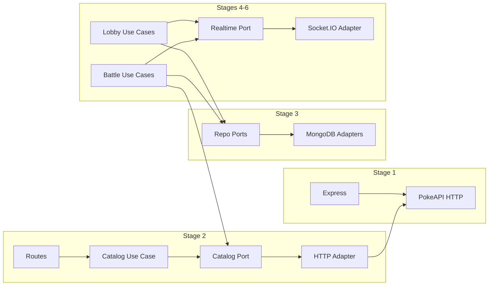

# Phased Plan — PokePVP

This plan is based on [architecture.md](architecture.md) and [business-rules.md](business-rules.md). The final backend will be hexagonal, with Express, MongoDB, and Socket.IO. Incremental stages are planned; the **first** is a simple Express structure with no architecture, only to consume the external Pokémon API.

**Current progress:** All stages complete (Stage 1–6). Stage 6 delivers the full battle flow: turns (first by Speed, then alternating), damage, defeat, and game end.

---

## Stage 1 — Minimal Express + PokeAPI proxy (first deliverable) ✅ DONE

**Goal:** Minimal Express app running on port 8080, listening on `0.0.0.0`, exposing routes that query the external Pokémon API. No layers, no ports/adapters, no database or Socket.IO.

**External API (per business-rules):**

- Base URL: `https://pokemon-api-92034153384.us-central1.run.app/`
- `GET /list` — returns a list with at least `id` and `name`
- `GET /list/:id` — returns detail (id, name, type, hp, attack, defense, speed, sprite)

**Proposed structure (simple):**

```
pokepvp/
  package.json
  .env.example
  src/
    index.js          # bootstrap: Express, routes, listen(8080, '0.0.0.0')
    routes/
      catalog.js      # GET /catalog/list and GET /catalog/list/:id → proxy to external API
    services/         # optional and minimal: one function that fetches/calls the API
      pokeapi.js
```

**Stage 1 deliverables:**

- [x] `package.json` with Express and an HTTP client (native fetch in Node 18+). Scripts: `start`, `dev` (nodemon).
- [x] Environment variables: `PORT=8080`, `POKEAPI_BASE_URL=https://pokemon-api-92034153384.us-central1.run.app` (no hardcoded values per architecture).
- [x] **GET /catalog/list** route: proxy to `GET {POKEAPI_BASE_URL}/list`, return JSON to the client.
- [x] **GET /catalog/list/:id** route: proxy to `GET {POKEAPI_BASE_URL}/list/:id`, return JSON.
- [x] **GET /health**: `200` to verify the server is up.
- [x] Basic error handling: if the external API fails or returns 4xx/5xx, respond with an appropriate status and message (502, 503).

**Success criteria:** `npm run dev` starts the server on 8080; `GET http://localhost:8080/catalog/list` and `GET http://localhost:8080/catalog/list/1` return the same data as the external API (or a controlled error if the API is unavailable).

---

## Stage 2 — Introduce hexagonal structure (domain + catalog port) ✅ DONE

> **Detailed specification:** See [stage-2-spec.md](stage-2-spec.md) for folder structure, components, data flow, and implementation checklist.

- [x] Create folders: `domain/ports`, `domain/entities`, `application/use-cases`, `infrastructure/http` (controllers), `infrastructure/clients` (PokeAPI client), `infrastructure/mappers`, `infrastructure/persistence`. Ports live in **domain** (domain defines the contracts; infrastructure implements them).
- [x] Define the **catalog output port** (`domain/ports/catalog.port.js`): interface with `getList()` and `getById(id)`.
- [x] Implement the **output adapter** (`infrastructure/clients/pokeapi.adapter.js`) behind that port; custom errors in `infrastructure/errors/`.
- [x] **Naming (Option B):** API and port use **catalog** (routes `/catalog/list`, `CatalogPort`, `CatalogController`); use cases use **Pokémon** (`GetPokemonListUseCase`, `GetPokemonByIdUseCase`). Controllers call these use cases; use cases use the catalog port.
- [x] The Express app exposes the same routes (`/catalog/list`, `/catalog/list/:id`, `/health`); code reorganized into hexagonal layers. Verified with Bruno.
- [x] Security: Helmet, CORS. Testing: Jest + supertest. Bootstrap split into `index.js` + `app.js` (`createApp()` for testability).

---

## Stage 3 — MongoDB and persistence ✅ DONE

> **Detailed specification:** See [stage-3-spec.md](stage-3-spec.md) for folder structure, entities, repository ports, MongoDB adapters, and implementation checklist.

- [x] Define **persistence ports** (repositories) for: Player, Lobby, Team selection, Battle, Pokémon state (per [architecture.md](architecture.md) and [business-rules.md](business-rules.md)).
- [x] Implement **MongoDB adapters** for those repositories (schemas, basic indexes).
- [x] Configuration via environment variables (`MONGODB_URI`); optional `MONGO_HOST_PORT` for Docker Compose; connection in `infrastructure/persistence/mongodb/connection.js`.
- [x] Domain entities in `domain/entities/`; repository ports in `domain/ports/`; Mongoose schemas and adapters in `infrastructure/persistence/mongodb/`.
- [x] Bootstrap: `index.js` connects to MongoDB when `MONGODB_URI` is set; `createApp(options)` accepts optional `repositories` for tests.
- [x] Verification: minimal REST routes (Option A) — `PersistenceController` with `POST /lobby`, `GET /lobby/active`, `POST /player`.

---

## Stage 4 — Lobby and team flow (REST or basic Socket.IO) ✅ DONE

> **Detailed specification:** See [stage-4-spec.md](stage-4-spec.md) for use cases, REST API, and implementation checklist.

- [x] **Use cases:** Join lobby (nickname), Assign team (3 random Pokémon, no duplicates between players), Mark ready.
- [x] Lobby state transitions: `waiting` → `ready` when both players confirm.
- [x] REST API: `POST /lobby/join`, `POST /lobby/:lobbyId/assign-team`, `POST /lobby/:lobbyId/ready`, `GET /lobby/active`, `GET /lobby/:lobbyId` (LobbyController mounted at `/lobby`).
- [x] Lobby entity extended with `readyPlayerIds`; MarkReady requires team assigned before ready.
- [x] Business rules: same catalog as in business-rules; random teams; no duplicate Pokémon between the two players.
- [x] Socket.IO added in Stage 5 to complement REST for real-time events (lobby_status, battle_start, turn_result, battle_end).

---

## Stage 5 — Socket.IO and real-time events ✅ DONE

> **Detailed specification:** See [stage-5-spec.md](stage-5-spec.md) for folder structure, realtime port, Socket.IO adapter and handler, events, and implementation checklist.

- [x] Integrate Socket.IO on the server (same port 8080 or path `/socket.io`).
- [x] **Real-time output port**: interface to notify (e.g. `notifyLobbyStatus`, `notifyBattleStart`, etc.).
- [x] **Socket.IO adapter** that implements that port (rooms per lobby, emit to clients).
- [x] Map client → server events: `join_lobby`, `assign_pokemon`, `ready`, `attack`.
- [x] Emit server → client events: `lobby_status`, `battle_start`, `turn_result`, `battle_end` per business-rules.

---

## Stage 6 — Battle: turns, damage, and game end ✅ DONE

- **Use cases:** Start battle (when lobby is `ready`), Process attack (atomic), Resolve defeat, End battle.
- Damage formula: `Damage = Attacker Attack - Defender Defense`; minimum 1; HP never below 0.
- Turn order: first turn by Speed (tie with a deterministic rule); then turns alternate between players.
- Domain events (e.g. `BattleStarted`, `TurnResolved`, `PokemonDefeated`, `BattleEnded`) and Socket.IO adapter subscription to emit to clients.
- Persist battle state and each Pokémon state (current HP, defeated).

---

## Dependency diagram (final vision)



---

## Summary

| Stage | Content | Status |
| ----- | ------- | ------ |
| **1** | Minimal Express, routes `/catalog/list`, `/catalog/list/:id`, `/health`, proxy to PokeAPI, config via env. | ✅ Done |
| **2** | Hexagonal structure: domain, catalog port, HTTP adapter, Pokémon use cases (Option B naming). | ✅ Done |
| **3** | Repository ports and MongoDB implementations. | ✅ Done |
| **4** | Lobby and team assignment (use cases + REST). | ✅ Done |
| **5** | Socket.IO, real-time port, lobby/battle events. | ✅ Done |
| **6** | Full battle: turns, damage, defeat, game end and events. | ✅ Done |

**Stage 1** is deliberately flat (no domain/ports/adapters folders) to quickly validate Express and integration with the PokeAPI; from Stage 2 onward the architecture described in [architecture.md](architecture.md) is introduced.
