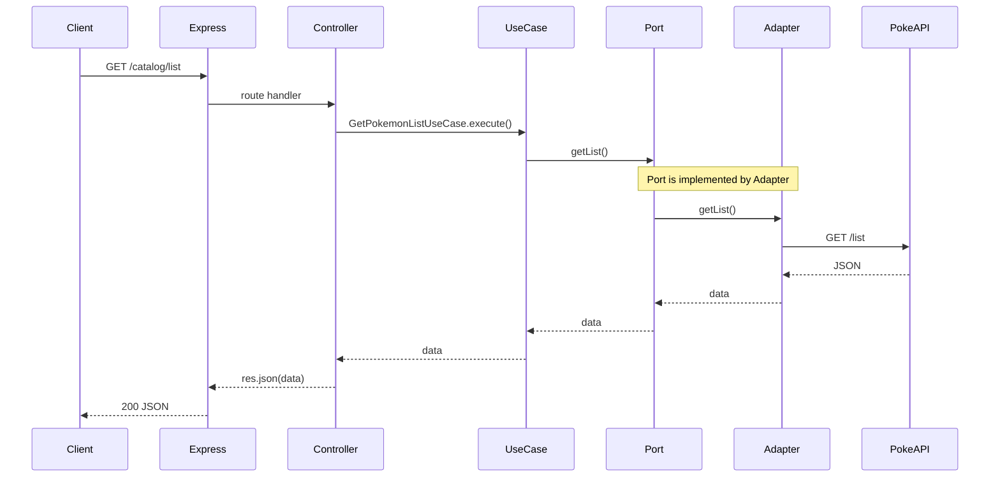

# Stage 2 — Hexagonal Structure (Detailed Specification) ✅ DONE

This document details what must be built in **Stage 2** of the PokePVP phased plan. It expands on [phased-plan.md](phased-plan.md) and aligns with [architecture.md](architecture.md). **Status:** Implemented and verified (endpoints tested with Bruno).

---

## 1. Goal

Reorganize the existing Stage 1 code into a **hexagonal (ports and adapters)** structure. The external behavior remains identical: same routes, same responses. Only the internal organization changes.

**Key principle:** The domain and application layers depend on **abstractions** (ports), not on concrete implementations (Express, fetch, etc.). Infrastructure implements those abstractions.

---

## 2. Target Folder Structure

The project uses an **infrastructure** layer (instead of "adapters") to align with Clean Architecture. **Ports** live in `domain/ports` (the domain defines the contracts it needs). Input adapters (HTTP controllers) and output adapters (external clients, persistence) live under `infrastructure/`.

**Naming convention (Option B):** **Catalog** = API and port (routes `/catalog/list`, `CatalogPort`, `CatalogController`). **Pokemon** = domain/use cases (e.g. `GetPokemonListUseCase`, `GetPokemonByIdUseCase`). The API exposes a "catalog"; the application layer speaks in terms of "Pokémon".

```
src/
  index.js                    # entry: load env, createApp(), listen
  app.js                      # createApp(options): wires helmet, cors, routes, error middleware; supports catalogPort override for tests
  domain/
    ports/
      catalog.port.js         # output port: interface for fetching catalog (domain defines the contract)
    entities/                 # (empty for Stage 2; entities come in later stages)
  application/
    use-cases/
      get-pokemon-list.use-case.js    # GetPokemonListUseCase
      get-pokemon-by-id.use-case.js   # GetPokemonByIdUseCase
  infrastructure/
    http/
      catalog.controller.js   # CatalogController: exposes /catalog, delegates to Pokémon use cases
    clients/
      pokeapi.adapter.js      # implements catalog port via HTTP to PokeAPI (output adapter)
    mappers/                  # (empty for Stage 2; data transformation in later stages)
    persistence/              # (empty for Stage 2; MongoDB in Stage 3)
```

---

## 3. Components in Detail

### 3.1 Output Port — Catalog Port

**File:** `domain/ports/catalog.port.js`

The **output port** is an abstraction (interface) that defines how the domain obtains catalog data. The domain owns the contract; use cases depend on this abstraction, not on HTTP or PokeAPI. Infrastructure implements it.

**Responsibilities:**
- Define the contract: `getList()` and `getById(id)`
- No implementation; only the interface

**Example (JavaScript — using a factory or object with methods):**

```javascript
/**
 * Output port for the Pokémon catalog.
 * Implementations fetch data from external sources (e.g. PokeAPI).
 */
// In JS we use a "port object" or documentation; implementations must provide:
// - getList(): Promise<Array<{ id, name }>>
// - getById(id: string|number): Promise<Object>
```

In JavaScript (without TypeScript), the port can be:
- A JSDoc-documented module that exports the expected shape
- Or a simple factory that receives an implementation and validates it

The **adapter** will implement this contract by calling the external API.

---

### 3.2 Output Adapter — PokeAPI Adapter

**File:** `infrastructure/clients/pokeapi.adapter.js`

Implements the catalog port by making HTTP requests to the external Pokémon API (the same logic currently in `services/pokeapi.js`).

**Responsibilities:**
- Read `POKEAPI_BASE_URL` from environment
- `getList()` → `GET {baseUrl}/list`
- `getById(id)` → `GET {baseUrl}/list/:id`
- Map HTTP errors (4xx, 5xx) to thrown errors with `status` property (for downstream error handling)
- **No** knowledge of Express, routes, or use cases

**Migration:** Move and adapt the logic from `src/services/pokeapi.js`. The adapter exports an object that satisfies the catalog port contract.

---

### 3.3 Use Cases

**Files:**
- `application/use-cases/get-pokemon-list.use-case.js` — `GetPokemonListUseCase`
- `application/use-cases/get-pokemon-by-id.use-case.js` — `GetPokemonByIdUseCase`

Use cases orchestrate the flow. They receive the catalog port (injected) and delegate to it. In Stage 2 there is no business logic beyond "get Pokémon data from catalog". Naming uses **Pokémon** (domain) while the port remains **catalog** (source).

**GetPokemonListUseCase:**
- Receives: `catalogPort` (dependency injection)
- Returns: `Promise<Array>` — the list from the port
- No parameters; delegates to `catalogPort.getList()`

**GetPokemonByIdUseCase:**
- Receives: `catalogPort`, `id`
- Returns: `Promise<Object>` — the Pokémon detail from the port
- Delegates to `catalogPort.getById(id)`

**Important:** Use cases must **not** import Express, fetch, or any adapter directly. They receive the port as a parameter (or via a factory).

---

### 3.4 Input Adapter — Catalog Controller

**File:** `infrastructure/http/catalog.controller.js`

**CatalogController** exposes the catalog API (routes under `/catalog`) and delegates to the Pokémon use cases. The controller name reflects the API resource ("catalog"); internally it uses `GetPokemonListUseCase` and `GetPokemonByIdUseCase`.

**Responsibilities:**
- `GET /list` → call `GetPokemonListUseCase.execute()` → send JSON response
- `GET /list/:id` → call `GetPokemonByIdUseCase.execute(id)` → send JSON response
- Error handling: map use case / adapter errors to HTTP status (400, 404, 502, 503) and JSON `{ error: string }`
- **No** direct calls to PokeAPI or fetch; only to use cases

**Dependency injection:** The controller receives the two use cases when created. The bootstrap (`index.js`) wires everything together.

---

### 3.5 Bootstrap — index.js and app.js

**Files:** `src/index.js`, `src/app.js`

Bootstrap is split for **testability**: `index.js` is the entry point; `app.js` exports `createApp(options)` so the app can be tested with supertest without starting the server.

**index.js** — Entry point:
- Load environment (dotenv)
- Call `createApp()` from `app.js`
- Start Express on `PORT` and `0.0.0.0`

**app.js** — `createApp(options)`:
- Create the output adapter (PokeAPI adapter) or use `options.catalogPort` for tests
- Create use cases, injecting the catalog port
- Create the catalog controller, injecting the use cases
- Mount security middleware: **Helmet**, **CORS** (origin from `CORS_ORIGIN` env, default `http://localhost:3000`)
- Mount routes: `/health`, `/catalog` (controller)
- Global error middleware
- Return the Express app (no listen)

**Dependency flow:**
```
PokeAPIAdapter (implements Catalog Port)
    ↓
GetPokemonListUseCase / GetPokemonByIdUseCase (depend on Catalog Port)
    ↓
CatalogController (depends on use cases; exposes /catalog)
    ↓
Express app
```

---

## 4. Data Flow Diagram



---

## 5. What Changes vs What Stays

| Current (Stage 1)           | Stage 2                                      |
|----------------------------|----------------------------------------------|
| `routes/catalog.js`        | `infrastructure/http/catalog.controller.js` (CatalogController)  |
| `services/pokeapi.js`      | `infrastructure/clients/pokeapi-adapter.js`  |
| Routes call pokeapi directly | Routes call use cases; use cases call port |
| No ports, no use cases     | Port + use cases + adapters                  |
| `index.js`                 | `index.js` (entry) + `app.js` (createApp, DI, testability) |

**Unchanged:**
- Routes: `/catalog/list`, `/catalog/list/:id`, `/health`
- Response format and error handling behavior
- Environment variables: `PORT`, `POKEAPI_BASE_URL`, `CORS_ORIGIN` (optional; default `http://localhost:3000`)

**Added (security):** Helmet (HTTP security headers), CORS (allowed origins for frontend).

---

## 6. Implementation Checklist

- [x] Create folder structure: `domain/ports/`, `domain/entities/`, `application/use-cases/`, `infrastructure/http/`, `infrastructure/clients/`, `infrastructure/mappers/`, `infrastructure/persistence/`
- [x] Define catalog output port (interface contract) — `domain/ports/catalog.port.js`
- [x] Implement PokeAPI adapter — `infrastructure/clients/pokeapi.adapter.js` (with `infrastructure/errors/` for ThirdPartyApiFailedError, InvalidConfigError)
- [x] Implement `GetPokemonListUseCase` (get-pokemon-list.use-case.js)
- [x] Implement `GetPokemonByIdUseCase` (get-pokemon-by-id.use-case.js)
- [x] Implement CatalogController (input adapter) — `infrastructure/http/catalog.controller.js`
- [x] Update `index.js` and `app.js` — bootstrap split: `createApp(options)` in app.js for testability (Jest + supertest)
- [x] Security: Helmet, CORS (configurable via `CORS_ORIGIN`)
- [x] Remove or deprecate `routes/catalog.js` and `services/pokeapi.js` (replaced by hexagonal layers)
- [x] Verify: `npm run dev` works; `GET /catalog/list` and `GET /catalog/list/:id` return same data as Stage 1 (tested with Bruno)
- [x] Tests: Jest + supertest (integration and unit tests)

---

## 7. Success Criteria

1. **Same external behavior:** All Stage 1 routes work identically.
2. **Clean dependencies:** Use cases and domain do not import Express, fetch, or any adapter.
3. **Testability:** Use cases can be tested with a mock catalog port; `createApp({ catalogPort })` allows integration tests with supertest without hitting the real PokeAPI.
4. **Single responsibility:** Each file has one clear purpose (port, adapter, use case, controller).

---

## 8. References

- [phased-plan.md](phased-plan.md) — Stage 2 summary
- [architecture.md](architecture.md) — Full hexagonal architecture
- [business-rules.md](business-rules.md) — Catalog API contract

**Why `domain/ports`?** The domain defines the contracts (interfaces) it needs; infrastructure implements them. This aligns with hexagonal architecture (inversion of dependency).
