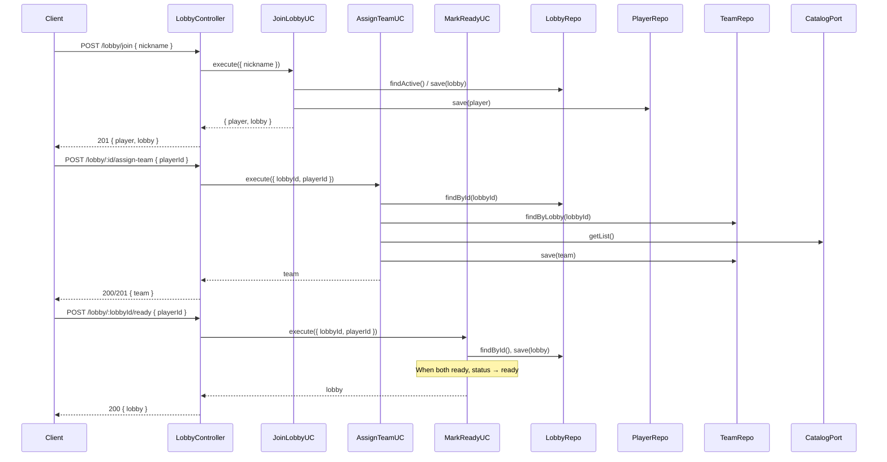

# Stage 4 — Lobby and Team Flow (Detailed Specification)

This document details what must be built in **Stage 4** of the PokePVP phased plan. It expands on [phased-plan.md](phased-plan.md) and aligns with [architecture.md](architecture.md) and [business-rules.md](business-rules.md). **Status:** ✅ Done.

---

## 1. Goal

Implement the **lobby and team flow** so that two players can join a lobby (with nickname), receive a random team of 3 Pokémon each (no duplicates between players), and mark themselves ready. When both players have confirmed ready, the lobby status transitions from `waiting` to `ready` (battle start is Stage 6; here we only reach the `ready` state).

**Key principle:** Use cases depend on existing repository ports (Player, Lobby, Team) and the CatalogPort (to obtain the Pokémon list for random assignment). No Socket.IO in this stage — flow is exposed via **REST** (POST/GET). Socket.IO and real-time events are Stage 5.

**Business rules (from business-rules.md §2–3):**
- Player enters with **trainer nickname only**.
- Each player gets **exactly 3 Pokémon**, assigned **randomly** from the catalog.
- **No Pokémon may be repeated between the two players** (each Pokémon in the match is assigned to exactly one player).
- Both players must **confirm ready**; lobby goes from `waiting` to `ready` when both have confirmed.

---

## 2. Target Folder Structure

New use cases live in `application/use-cases/`. A dedicated **Lobby controller** (or extended persistence/lobby controller) exposes REST endpoints. The domain may extend the Lobby entity to track which players have marked ready.

```
src/
  index.js
  app.js
  domain/
    ports/
      catalog.port.js              # (existing)
      player.repository.js         # (existing)
      lobby.repository.js          # (existing)
      team.repository.js           # (existing)
      battle.repository.js         # (existing)
      pokemon-state.repository.js  # (existing)
    entities/
      player.entity.js             # (existing)
      lobby.entity.js              # (existing; extend with readyPlayerIds)
      team.entity.js               # (existing)
      battle.entity.js             # (existing)
      pokemon-state.entity.js      # (existing)
  application/
    use-cases/
      get-pokemon-list.use-case.js     # (existing)
      get-pokemon-by-id.use-case.js    # (existing)
      join-lobby.use-case.js           # NEW: join lobby with nickname
      assign-team.use-case.js          # NEW: assign 3 random Pokémon (no dupes between players)
      mark-ready.use-case.js           # NEW: mark player ready; transition lobby to ready when both
  infrastructure/
    http/
      catalog.controller.js        # (existing)
      persistence.controller.js    # (existing; Stage 3 verification routes)
      lobby.controller.js          # NEW: REST for join, assign, ready, get lobby
    clients/
      pokeapi.adapter.js           # (existing)
    persistence/
      mongodb/                     # (existing; schemas may need readyPlayerIds on Lobby)
```

**Naming:** The new controller is **LobbyController** and exposes the lobby/team flow. **Implementation:** PersistenceController is **not** mounted when repositories are available; only LobbyController at `/lobby` is used for the lobby flow (PersistenceController remains in the codebase for unit tests but is not registered in `app.js`).

---

## 3. Domain Extensions

### 3.1 Lobby entity — track ready players

**File:** `domain/entities/lobby.entity.js`

To support “both players ready → status = ready”, the lobby must track which players have marked ready.

- **Add field:** `readyPlayerIds` (array of player ids). When `readyPlayerIds` contains both players in `playerIds` (and there are exactly 2 players), the use case sets `status` to `'ready'`.
- **Invariant:** `readyPlayerIds` is a subset of `playerIds`; no duplicates.

**Updated Lobby shape (domain):**
- `id`, `status`, `playerIds`, `readyPlayerIds` (optional; default `[]`), `createdAt`

MongoDB schema and adapter in infrastructure must be updated to persist `readyPlayerIds` (see §6).

---

## 4. Use Cases in Detail

Use cases receive repositories and the catalog port via dependency injection. They contain the business logic; they do not know about HTTP or Express.

### 4.1 JoinLobbyUseCase

**File:** `application/use-cases/join-lobby.use-case.js`

**Purpose:** A player joins the lobby with a nickname. If there is no active lobby, create one; if there is an active lobby in `waiting` with one player, add the second player; otherwise return an error (lobby full or not in waiting).

**Dependencies:** `playerRepository`, `lobbyRepository`.

**Input:** `{ nickname: string }`.

**Flow:**
1. Validate nickname (non-empty string).
2. Find active lobby (`lobbyRepository.findActive()`).
3. If no active lobby: create a new lobby with `status: 'waiting'`, `playerIds: []`, `readyPlayerIds: []`. Create player with nickname; save player; add player id to lobby’s `playerIds`; save lobby. Return `{ player, lobby }`.
4. If active lobby exists and `status !== 'waiting'`: throw (e.g. lobby already in game or finished).
5. If active lobby has 1 player: create player with nickname; save player; append player id to lobby’s `playerIds`; save lobby. Return `{ player, lobby }`.
6. If active lobby already has 2 players: throw (lobby full).

**Output:** `Promise<{ player: Player, lobby: Lobby }>`.

**Errors:** Validation (invalid nickname), Conflict (lobby full or lobby not in waiting).

---

### 4.2 AssignTeamUseCase

**File:** `application/use-cases/assign-team.use-case.js`

**Purpose:** Assign 3 random Pokémon to a player in a lobby. The 3 Pokémon must not repeat any Pokémon already assigned to the other player(s) in the same lobby (no duplicates between players).

**Dependencies:** `catalogPort`, `lobbyRepository`, `teamRepository`.

**Input:** `{ lobbyId: string, playerId: string }`.

**Flow:**
1. Load lobby by id; if not found or status not `waiting`, throw.
2. Check that `playerId` is in `lobby.playerIds`.
3. Load existing teams for this lobby (`teamRepository.findByLobby(lobbyId)`). Collect all `pokemonIds` already assigned in the lobby (from the other player(s)).
4. Get full catalog list from `catalogPort.getList()`.
5. Filter catalog to ids not in the “already assigned in lobby” set.
6. If fewer than 3 available, throw (e.g. catalog too small or lobby already has too many assigned).
7. Randomly pick 3 distinct ids from the available list (e.g. shuffle and take 3).
8. Save or update team: `{ lobbyId, playerId, pokemonIds: [id1, id2, id3] }` (one team per player per lobby — upsert by lobbyId+playerId).
9. Return the saved team (and optionally lobby for client convenience).

**Output:** `Promise<Team>` — returns the saved team (implementation returns the team only; 200 + team in REST).

**Errors:** NotFound (lobby or player not in lobby), Validation/Conflict (lobby not in waiting, not enough Pokémon available).

**Business rule:** Same catalog as business-rules; random teams; no duplicate Pokémon between the two players.

---

### 4.3 MarkReadyUseCase

**File:** `application/use-cases/mark-ready.use-case.js`

**Purpose:** Mark a player as ready in the lobby. When both players in the lobby have marked ready, set lobby status to `'ready'`.

**Dependencies:** `lobbyRepository`, `teamRepository` (optional: verify player has a team before allowing ready).

**Input:** `{ lobbyId: string, playerId: string }`.

**Flow:**
1. Load lobby by id; if not found, throw.
2. Check that `playerId` is in `lobby.playerIds`.
3. Ensure the player has a team assigned (`teamRepository.findByLobbyAndPlayer(lobbyId, playerId)`); if not, throw (must assign team before ready). **Implemented:** required.
4. If `playerId` is already in `lobby.readyPlayerIds`, return lobby (idempotent).
5. Add `playerId` to `readyPlayerIds`; save lobby.
6. If `readyPlayerIds` now contains both players (length === 2 and equals the set of playerIds), set `status` to `'ready'` and save lobby.
7. Return the updated lobby.

**Output:** `Promise<Lobby>`.

**Errors:** NotFound (lobby or player not in lobby), Validation (no team assigned if you enforce that).

---

## 5. REST API (Lobby Controller)

**File:** `infrastructure/http/lobby.controller.js`

**LobbyController** exposes the lobby and team flow. Mount under a base path (e.g. `/lobby` or `/api/lobby`).

| Method | Path | Body / Params | Description |
|--------|------|----------------|-------------|
| POST   | `/lobby/join` | `{ nickname: string }` | Join lobby (create or add to existing). Returns `{ player, lobby }`. |
| POST   | `/lobby/:lobbyId/assign-team` | `{ playerId: string }` or playerId in body | Assign 3 random Pokémon for the player in the lobby. Returns team (or team + lobby). |
| POST   | `/lobby/:lobbyId/ready` | `{ playerId: string }` | Mark player ready. Returns updated lobby. |
| GET    | `/lobby/active` | — | Get active lobby (reuse LobbyRepository.findActive). Returns lobby or 404. |
| GET    | `/lobby/:lobbyId` | — | Get lobby by id. Returns lobby or 404. |

**Error handling:** Map use case errors to HTTP status (400 validation, 404 not found, 409 conflict) and JSON `{ error: string }`. The implementation uses **application-layer errors** (`application/errors/`: ValidationError, NotFoundError, ConflictError); LobbyController imports these and implements `statusFromError`-style logic.

**Dependency injection:** LobbyController receives the three use cases (JoinLobby, AssignTeam, MarkReady) and optionally LobbyRepository for GET endpoints. Bootstrap in `app.js` creates use cases with repositories and catalog port, then creates LobbyController and mounts its router.

---

## 6. Persistence Updates (Lobby schema)

The Lobby document must persist `readyPlayerIds`.

- **Schema (Mongoose):** Add `readyPlayerIds` (array of ObjectId or string), default `[]`.
- **Adapter:** When mapping document ↔ entity, include `readyPlayerIds`. Existing `findActive()` and `findById()` return it so use cases can read it.

No new repositories; only extend the existing Lobby entity and Lobby MongoDB schema/adapter.

---

## 7. Bootstrap and Wiring (app.js)

- Create **JoinLobbyUseCase** with `playerRepository`, `lobbyRepository`.
- Create **AssignTeamUseCase** with `catalogPort`, `lobbyRepository`, `teamRepository`.
- Create **MarkReadyUseCase** with `lobbyRepository`, `teamRepository`.
- Create **LobbyController** with the three use cases and `lobbyRepository` (for GET lobby/active and GET lobby/:id).
- Mount LobbyController router (e.g. `/lobby` or `/api/lobby`) only when persistence is available (same condition as PersistenceController).
- **Optional:** Keep PersistenceController routes for Stage 3 verification or remove/deprecate them in favour of the new use-case–driven flow (POST /lobby/join replaces manual POST /player + manual lobby creation).

---

## 8. Data Flow Diagram



---

## 9. What Changes vs What Stays

| Stage 3 | Stage 4 |
|---------|---------|
| PersistenceController: POST /lobby, GET /lobby/active, POST /player (raw) — no longer mounted | LobbyController at `/lobby`: POST /join, POST /:lobbyId/assign-team, POST /:lobbyId/ready, GET /active, GET /:lobbyId |
| Lobby entity: status, playerIds | Lobby entity: + readyPlayerIds |
| No join/assign/ready use cases | JoinLobbyUseCase, AssignTeamUseCase, MarkReadyUseCase |
| Catalog used only for catalog routes | Catalog port also used by AssignTeamUseCase for random team |

**Unchanged:**
- All repository ports and MongoDB adapters (except Lobby schema + adapter for readyPlayerIds).
- Catalog and health routes.
- Hexagonal structure: use cases depend on ports only; no Express in domain/application.

---

## 10. Implementation Checklist (Step-by-Step)

Execute in order; each step is verifiable.

### Step 1 — Domain: extend Lobby entity
- [x] In `domain/entities/lobby.entity.js`, add `readyPlayerIds` to the Lobby typedef (array of string, optional, default empty).
- [x] Export a constant or key for `readyPlayerIds` (e.g. `READY_PLAYER_IDS_KEY`).

### Step 2 — Persistence: Lobby schema and adapter
- [x] In `infrastructure/persistence/mongodb/schemas/lobby.schema.js`, add field `readyPlayerIds` (array, default `[]`).
- [x] In `infrastructure/persistence/mongodb/adapters/lobby.mongo.repository.js`, map `readyPlayerIds` in document ↔ entity (read and write).

### Step 3 — Use case: JoinLobbyUseCase
- [x] Create `application/use-cases/join-lobby.use-case.js`.
- [x] Implement flow: validate nickname → findActive lobby → create lobby + player or add player to existing lobby; return `{ player, lobby }`.
- [x] Throw appropriate errors (validation, conflict for full lobby or non-waiting lobby).
- [x] Add unit tests for JoinLobbyUseCase (e.g. no lobby → creates lobby and player; existing lobby with 1 player → adds second; 2 players → throws).

### Step 4 — Use case: AssignTeamUseCase
- [x] Create `application/use-cases/assign-team.use-case.js`.
- [x] Implement flow: load lobby and teams → get catalog list → exclude already-assigned ids in lobby → pick 3 random distinct → save team.
- [x] Ensure one team per player per lobby (upsert by lobbyId + playerId). Catalog response normalized (array or `payload.data`).
- [x] Add unit tests (e.g. first player gets 3 random; second player gets 3 different from first). Optional `randomFn` in constructor for tests.

### Step 5 — Use case: MarkReadyUseCase
- [x] Create `application/use-cases/mark-ready.use-case.js`.
- [x] Implement flow: load lobby → add playerId to readyPlayerIds → if both players ready, set status to `'ready'` → save and return lobby.
- [x] Require team to exist before allowing ready (ValidationError if no team).
- [x] Add unit tests (one ready → status stays waiting; both ready → status becomes ready).

### Step 6 — HTTP: LobbyController
- [x] Create `infrastructure/http/lobby.controller.js`.
- [x] Implement routes: POST `/join`, POST `/:lobbyId/assign-team`, POST `/:lobbyId/ready`, GET `/active`, GET `/:lobbyId` (mount order: `/active` before `/:lobbyId`).
- [x] Wire use cases and lobbyRepository; map use case errors to HTTP status and JSON `{ error }`.
- [x] Add integration tests (e.g. join twice → get lobby with 2 players; assign team for both; mark both ready → lobby status ready).

### Step 7 — Bootstrap: wire use cases and LobbyController
- [x] In `app.js`, instantiate JoinLobbyUseCase, AssignTeamUseCase, MarkReadyUseCase with required repositories and catalogPort.
- [x] Create LobbyController with use cases and lobbyRepository; mount its router at `/lobby` when repositories are available.
- [x] No new env vars beyond Stage 3.

### Step 8 — Verification and cleanup
- [x] Run full test suite; fix any regressions.
- [x] Manually or via Bruno: POST /lobby/join (player 1), POST /lobby/join (player 2), GET /lobby/active, POST /lobby/:lobbyId/assign-team for each player, POST /lobby/:lobbyId/ready for each → GET /lobby/active shows status `ready`.
- [x] PersistenceController is not mounted; lobby flow is only via LobbyController. PersistenceController remains in codebase for unit tests.

---

## 11. Success Criteria

1. **Join lobby:** A client can join with a nickname; first join creates lobby + player, second join adds second player to same lobby. Lobby is in `waiting` with 2 `playerIds`.
2. **Assign team:** Each player can request team assignment; each gets 3 random Pokémon from the catalog; no Pokémon is shared between the two players.
3. **Mark ready:** Each player can mark ready; when both have marked ready, lobby status becomes `ready`.
4. **REST only:** All behaviour is reachable via REST; no Socket.IO in this stage.
5. **Hexagonal:** Use cases depend only on repository and catalog ports; no Express or MongoDB in application/domain.
6. **Tests:** Unit tests for the three use cases; integration tests for the lobby flow (join → assign → ready).

---

## 12. Implementation Notes (as built in this branch)

- **Errors:** Use cases and LobbyController use `application/errors/` (ValidationError, NotFoundError, ConflictError), not infrastructure errors.
- **AssignTeamUseCase:** Accepts optional `options.randomFn` in the constructor for deterministic tests; normalizes catalog response (handles both array and `payload.data`).
- **LobbyController:** Route param for lobby id is `lobbyId`; GET `/active` is registered before GET `/:lobbyId` to avoid "active" being captured as id.
- **PersistenceController:** Not registered in `app.js`; only LobbyController at `/lobby` is mounted when `repositories` exist. PersistenceController file and its unit tests remain.

---

## 13. References

- [phased-plan.md](phased-plan.md) — Stage 4 summary
- [architecture.md](architecture.md) — Hexagonal architecture, use cases, ports
- [business-rules.md](business-rules.md) — §2 Team selection, §3 Lobby states, §8 Persistence
- [stage-2-spec.md](stage-2-spec.md) — Use case and controller structure
- [stage-3-spec.md](stage-3-spec.md) — Repository ports, entities, MongoDB adapters
