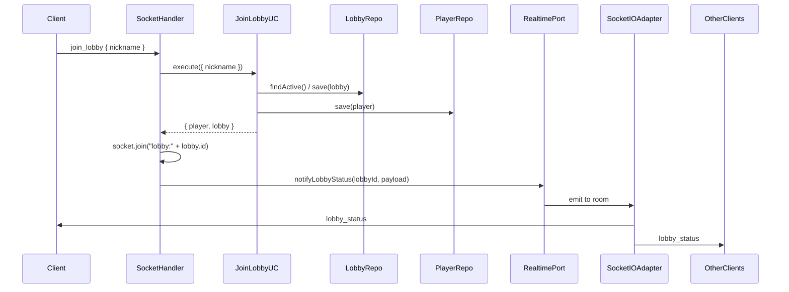

# Stage 5 — Socket.IO and Real-Time Events (Detailed Specification)

This document details what must be built in **Stage 5** of the PokePVP phased plan. It expands on [phased-plan.md](phased-plan.md) and aligns with [architecture.md](architecture.md) and [business-rules.md](business-rules.md). **Status:** ✅ Done.

---

## 1. Goal

Integrate **Socket.IO** on the same server (port 8080) to provide **real-time events** for the lobby and battle flow. Define a **real-time output port** (RealtimePort) so that the domain and use cases remain decoupled from Socket.IO; implement a **Socket.IO adapter** that uses rooms per lobby and emits to connected clients. Map **client → server** events (`join_lobby`, `assign_pokemon`, `ready`, `attack`) and **server → client** events (`lobby_status`, `battle_start`, `turn_result`, `battle_end`) per [business-rules.md](business-rules.md) §7.

**Key principle:** REST from Stage 4 remains unchanged; Socket.IO **complements** it for real-time UX. The Socket.IO handler and LobbyController share the same use cases (JoinLobby, AssignTeam, MarkReady). Use cases and domain depend only on the **RealtimePort** abstraction; infrastructure implements it with Socket.IO. The full battle logic (attack processing, damage, defeat) is **Stage 6**; in Stage 5, the `attack` event is documented and may be stubbed (e.g. emit "not implemented" or defer to Stage 6).

**Business rules (from business-rules.md §7):**
- Client → Server: `join_lobby`, `assign_pokemon`, `ready`, `attack`.
- Server → Client: `lobby_status`, `battle_start`, `turn_result`, `battle_end`.
- The system must notify when the battle starts, when a turn is resolved, when a Pokémon is defeated, when a new Pokémon enters, and when the battle ends with a winner.

---

## 2. Target Folder Structure

New artifacts: a **domain port** for real-time notifications and an **infrastructure** layer for Socket.IO (adapter + handler). No new use cases in Stage 5; the handler delegates to existing JoinLobby, AssignTeam, and MarkReady use cases.

```
src/
  index.js                          # (modified: create http.Server from app, attach Socket.IO, wire handler)
  app.js                            # (unchanged: createApp() returns Express app only)
  domain/
    ports/
      catalog.port.js               # (existing)
      player.repository.js          # (existing)
      lobby.repository.js            # (existing)
      team.repository.js            # (existing)
      battle.repository.js          # (existing)
      pokemon-state.repository.js   # (existing)
      realtime.port.js               # NEW: output port for real-time notifications
    entities/                       # (existing; no changes)
  application/
    use-cases/                      # (existing: join-lobby, assign-team, mark-ready; no new use cases in Stage 5)
  infrastructure/
    http/                           # (existing: catalog, lobby controllers)
    clients/                         # (existing)
    persistence/                    # (existing)
    socket/                          # NEW: Socket.IO adapter and handler
      socketio.adapter.js            # implements RealtimePort (rooms, emit)
      socket.handler.js             # listens for client events, calls use cases, then realtime port
```

**Naming:** The output port is **RealtimePort** (or `realtime.port.js`). The adapter is the **Socket.IO adapter** (implements the port). The **Socket handler** is the input adapter that receives Socket.IO events and delegates to use cases and to the realtime port.

---

## 3. Realtime Port (Domain)

### 3.1 Contract

**File:** `domain/ports/realtime.port.js`

The **output port** defines how the application notifies connected clients. The domain/application layer depends on this abstraction; it does not import Socket.IO or any transport. Implementations (e.g. Socket.IO adapter) live in infrastructure.

**Responsibilities:**
- Define the contract: methods to notify a lobby’s room with a given payload.
- No implementation in the domain; only the interface (JSDoc or documented shape).

**Required methods:**

| Method | Purpose |
|--------|--------|
| `notifyLobbyStatus(lobbyId, payload)` | Emit current lobby state to all clients in the lobby room. Called after join, assign-team, or ready so clients stay in sync. |
| `notifyBattleStart(lobbyId, payload)` | Signal that the battle has started (e.g. when both players are ready and battle is initiated; full flow in Stage 6). |
| `notifyTurnResult(lobbyId, payload)` | Send the outcome of a turn (damage, remaining HP, defeat/switch). Stage 6 implements the logic; port is used here. |
| `notifyBattleEnd(lobbyId, payload)` | Signal that the battle has ended (e.g. winner id). |

**Signatures (JavaScript contract):**
- `notifyLobbyStatus(lobbyId: string, payload: object): void | Promise<void>`
- `notifyBattleStart(lobbyId: string, payload: object): void | Promise<void>`
- `notifyTurnResult(lobbyId: string, payload: object): void | Promise<void>`
- `notifyBattleEnd(lobbyId: string, payload: object): void | Promise<void>`

**Room membership:** The port contract does not specify how clients join a room; that is the adapter’s concern. The adapter must ensure that when emitting to `lobbyId`, all sockets that joined that lobby’s room receive the event. The **handler** (input adapter) is responsible for joining the socket to the lobby room when the client completes `join_lobby` (see §5).

---

## 4. Socket.IO Adapter (Infrastructure)

### 4.1 Implementation of RealtimePort

**File:** `infrastructure/socket/socketio.adapter.js`

Implements the RealtimePort using Socket.IO. It receives the Socket.IO server (or namespace) and uses **rooms** keyed by lobby id.

**Room naming:** One room per lobby, e.g. `lobby:${lobbyId}`. All clients that have joined that lobby are added to this room by the handler; the adapter emits to the room so every member of the lobby receives the event.

**Event names (server → client):** Per business-rules §7:
- `lobby_status` — payload: lobby state (and optionally related data such as players/teams for UI).
- `battle_start` — payload: battle start data (e.g. battle id, initial Pokémon).
- `turn_result` — payload: turn outcome (damage, remaining HP, defeated, next Pokémon, etc.).
- `battle_end` — payload: e.g. `{ winnerId }` or full summary.

**Mapping from port methods to Socket.IO emits:**
- `notifyLobbyStatus(lobbyId, payload)` → `io.to('lobby:' + lobbyId).emit('lobby_status', payload)`
- `notifyBattleStart(lobbyId, payload)` → `io.to('lobby:' + lobbyId).emit('battle_start', payload)`
- `notifyTurnResult(lobbyId, payload)` → `io.to('lobby:' + lobbyId).emit('turn_result', payload)`
- `notifyBattleEnd(lobbyId, payload)` → `io.to('lobby:' + lobbyId).emit('battle_end', payload)`

**Dependencies:** The adapter is constructed with the Socket.IO server instance (or the default namespace). It does not depend on use cases or repositories.

---

## 5. Socket.IO Handler (Input Adapter)

### 5.1 Role

**File:** `infrastructure/socket/socket.handler.js`

The handler attaches to the Socket.IO server and listens for **client → server** events. It translates them into use case calls and then invokes the **RealtimePort** to notify the lobby room. It also joins each client’s socket to the appropriate lobby room when they join the lobby.

**Dependencies (injected):** JoinLobbyUseCase, AssignTeamUseCase, MarkReadyUseCase, RealtimePort (Socket.IO adapter), and LobbyRepository (used in assign_pokemon to fetch lobby after team assignment for notifyLobbyStatus). Same use cases as LobbyController so behaviour is consistent between REST and Socket.

### 5.2 Client → Server Events and Flow

| Event | Payload (from client) | Handler behaviour |
|-------|------------------------|-------------------|
| `join_lobby` | `{ nickname: string }` | Call JoinLobbyUseCase.execute({ nickname }). On success: join the socket to room `lobby:${lobby.id}`, store lobbyId/playerId on socket (e.g. `socket.data.lobbyId`, `socket.data.playerId`). Call realtimePort.notifyLobbyStatus(lobbyId, payload) with lobby (and optionally player) so all clients in the room get the update. Reply to the emitting socket with success (e.g. `{ player, lobby }`) or emit an error event on failure. |
| `assign_pokemon` | `{ lobbyId: string, playerId: string }` | Call AssignTeamUseCase.execute({ lobbyId, playerId }). On success: call realtimePort.notifyLobbyStatus(lobbyId, payload). Optionally ensure socket is in room `lobby:${lobbyId}` if not already. Reply or emit error on failure. |
| `ready` | `{ lobbyId: string, playerId: string }` | Call MarkReadyUseCase.execute({ lobbyId, playerId }). On success: call realtimePort.notifyLobbyStatus(lobbyId, payload). When lobby becomes `ready`, may emit `battle_start` later (Stage 6); in Stage 5, at least lobby_status is emitted with status `ready`. Reply or emit error on failure. |
| `attack` | (e.g. `{ lobbyId, playerId, ... }` — exact shape in Stage 6) | Documented here; full processing (ProcessAttackUseCase, damage, defeat, battle end) is **Stage 6**. In Stage 5: either ignore, or respond with an error event (e.g. `attack_not_available`) so clients know the event is accepted but not yet implemented. |

**Room membership:** When the client sends `join_lobby` and the use case returns a lobby, the handler must join that socket to `lobby:${lobby.id}`. For `assign_pokemon` and `ready`, the client sends `lobbyId`; the handler can re-join the socket to that room if not already in it (e.g. if the client reconnects).

**Error handling:** Map use case errors (ValidationError, NotFoundError, ConflictError) to a consistent error event to the client (e.g. `error` with `{ code, message }`), and do not emit to the room on failure.

---

## 6. Server → Client Events (Contract)

Per [business-rules.md](business-rules.md) §7. Payloads are implementation-defined but should be sufficient for the frontend to update UI.

| Event | When emitted | Payload (suggested shape) |
|-------|----------------|---------------------------|
| `lobby_status` | After join_lobby, assign_pokemon, or ready (when state changes). | `{ lobby: Lobby, players?: Player[], teams?: Team[] }` or minimal `{ lobby }`. |
| `battle_start` | When the battle officially starts (Stage 6: when both ready and battle is created). | `{ battleId, lobbyId, initialPokemon? }` or similar. |
| `turn_result` | After each attack is processed (Stage 6). | Damage dealt, defender remaining HP, defeated flag, next active Pokémon, etc. |
| `battle_end` | When one player has no remaining Pokémon. | `{ winnerId, battleId }` or full summary. |

**Required notifications (business-rules):** Battle starts; turn result (damage, HP); Pokémon defeated; new Pokémon enters; battle end with winner. The Socket.IO adapter and use cases in Stage 6 will drive when each event is emitted.

---

## 7. Bootstrap and Wiring

### 7.1 HTTP server and Socket.IO

- **app.js:** Unchanged. `createApp(options)` returns the **Express application** only (no HTTP server). This keeps existing tests that use `supertest(app)` valid.
- **index.js:** Instead of `app.listen(PORT, HOST, ...)`, create an HTTP server from the Express app and attach Socket.IO to it:
  1. `import http from 'http'`.
  2. `const app = createApp();`
  3. `const server = http.createServer(app);`
  4. `const io = new Server(server, { path: '/socket.io', cors: { origin: process.env.CORS_ORIGIN || 'http://localhost:3000' } });` (or equivalent Socket.IO constructor).
  5. If `repositories` exist (e.g. when `MONGODB_URI` is set), create JoinLobbyUseCase, AssignTeamUseCase, MarkReadyUseCase (same as in app.js), create the Socket.IO adapter (RealtimePort implementation), create the Socket handler with use cases + realtime port, and call `handler.attach(io)` (or equivalent) to register event listeners.
  6. `server.listen(PORT, HOST, ...)`.

**Optional:** To avoid duplicating use case construction, `createApp()` could accept an optional callback or return a wiring function that receives the Socket.IO server and attaches the handler (with use cases created inside app.js or passed in). The minimal approach is to construct use cases in index.js when wiring Socket.IO, reusing the same repository instances that would be used by createApp() for the REST routes. Alternatively, createApp can return `{ app, useCases, repositories }` when repositories exist, and index.js uses those to build the handler. The spec leaves this choice to the implementation; the important point is that the **same use cases** back both REST and Socket.

### 7.2 When Socket.IO is active

Socket.IO and the handler are only attached when persistence is available (same condition as mounting LobbyController), so when `MONGODB_URI` is set and repositories exist. No new environment variables are required for Stage 5; Socket.IO uses the same port (8080) and path `/socket.io`.

---

## 8. Data Flow Diagram



**Architecture alignment:** RealtimePort is an output port (domain); SocketIOAdapter is its implementation in infrastructure. SocketHandler is an input adapter that calls use cases (application) and the realtime port (output). See [architecture.md](architecture.md) layers diagram.

---

## 9. What Changes vs What Stays

| Stage 4 | Stage 5 |
|---------|---------|
| Only REST for lobby (LobbyController) | REST unchanged; Socket.IO added for same flow (join_lobby, assign_pokemon, ready) |
| No real-time port | RealtimePort in domain/ports; Socket.IO adapter in infrastructure/socket |
| index.js: app.listen(PORT, HOST) | index.js: http.createServer(app), attach Socket.IO, server.listen |
| No Socket.IO | Handler in infrastructure/socket; rooms per lobby; client/server events as in business-rules §7 |

**Unchanged:**
- All Stage 4 use cases (JoinLobby, AssignTeam, MarkReady); they are reused by the Socket handler.
- LobbyController and all REST routes (/catalog, /lobby, /health).
- Domain entities and repository ports; no new persistence in Stage 5.
- createApp() still returns the Express app for tests.

---

## 10. Implementation Checklist (Step-by-Step)

Execute in order; each step is verifiable.

### Step 1 — Domain: RealtimePort
- [x] Create `domain/ports/realtime.port.js`. Document the contract: `notifyLobbyStatus(lobbyId, payload)`, `notifyBattleStart(lobbyId, payload)`, `notifyTurnResult(lobbyId, payload)`, `notifyBattleEnd(lobbyId, payload)`. No implementation; JSDoc or comment is enough.

### Step 2 — Infrastructure: Socket.IO adapter
- [x] Create `infrastructure/socket/socketio.adapter.js`. Implement the RealtimePort: constructor receives Socket.IO server (or namespace); implement the four methods by emitting to room `lobby:${lobbyId}` with events `lobby_status`, `battle_start`, `turn_result`, `battle_end` and the given payload.

### Step 3 — Infrastructure: Socket handler
- [x] Create `infrastructure/socket/socket.handler.js`. Accept dependencies: JoinLobbyUseCase, AssignTeamUseCase, MarkReadyUseCase, realtimePort, lobbyRepository. Attach to `io` on connection: register listeners for `join_lobby`, `assign_pokemon`, `ready`, `attack`. For join_lobby: call use case, join socket to `lobby:${lobby.id}`, store lobbyId/playerId in socket.data, call realtimePort.notifyLobbyStatus; reply via ack or emit error. For assign_pokemon: call use case, join socket to room if not already, fetch lobby from lobbyRepository, notifyLobbyStatus; for ready: call use case, notifyLobbyStatus. For attack: emit error with code `attack_not_available` (Stage 6 will implement).

### Step 4 — Bootstrap: index.js
- [x] In `index.js`, create HTTP server from Express app; instantiate Socket.IO with the server (path `/socket.io`, CORS if needed). When repositories exist, create the same use cases as app.js, create the Socket.IO adapter and handler (with lobbyRepository), and attach the handler to `io`. Call `server.listen(PORT, HOST)` instead of `app.listen`.

### Step 5 — Verification
- [x] Run existing test suite; ensure no regressions (createApp() still returns Express app for supertest).
- [x] Manually or with a Socket.IO client: connect to `http://localhost:8080`, emit `join_lobby` with nickname, then `assign_pokemon` and `ready` with lobbyId/playerId; confirm `lobby_status` is received in the same socket and, with two clients in the same lobby, that both receive `lobby_status`.

### Step 6 — Optional: link from phased-plan
- [x] In `docs/phased-plan.md`, add under Stage 5: "> **Detailed specification:** See [stage-5-spec.md](stage-5-spec.md) for folder structure, realtime port, Socket.IO adapter and handler, events, and implementation checklist."

---

## 11. Success Criteria

1. **Socket.IO on same port:** The server listens on port 8080 and serves both HTTP (Express) and Socket.IO (e.g. path `/socket.io`) on the same process.
2. **RealtimePort and adapter:** The domain defines the realtime port; the Socket.IO adapter implements it with rooms per lobby and emits the four server→client events.
3. **Handler delegates to use cases:** Client events `join_lobby`, `assign_pokemon`, `ready` are handled by calling the existing use cases; after success, the handler notifies the lobby room via the realtime port.
4. **Room membership:** When a client joins a lobby via Socket, their socket is added to the room for that lobby and receives `lobby_status` (and later battle events).
5. **REST unchanged:** All Stage 4 REST endpoints and behaviour remain; Socket.IO is an additional transport.
6. **Hexagonal:** Use cases and domain do not depend on Socket.IO; they depend only on the RealtimePort abstraction.

---

## 12. Implementation Notes (as built)

- **RealtimePort:** JSDoc typedef in `domain/ports/realtime.port.js`; no runtime interface (plain JS).
- **SocketIOAdapter:** Exports `SocketIOAdapter` class; constructor receives `io`; helper `roomName(lobbyId)` returns `lobby:${lobbyId}`; all four notify methods emit to the room.
- **SocketHandler:** Exports `SocketHandler` class; constructor receives use cases, realtimePort, and lobbyRepository. `attach(io)` registers `connection` listener; each event handler uses optional `ack` callback for responses. Error payload: `{ code, message }`; emitted via `error` event and passed to ack on failure.
- **join_lobby:** Payload `{ lobby, player }` sent to room; ack returns `{ player, lobby }`.
- **assign_pokemon:** Fetches lobby from lobbyRepository after assign; joins socket to room if not already; payload `{ lobby }` to room; ack returns team.
- **ready:** Payload `{ lobby }` to room; ack returns updated lobby.
- **attack:** Emits `error` with `{ code: 'attack_not_available', message: 'Attack not implemented yet (Stage 6)' }`; ack receives same error object.
- **Testing:** See [socketio-test-flow.md](socketio-test-flow.md) for manual test flow with Postman or similar.

---

## 13. References

- [phased-plan.md](phased-plan.md) — Stage 5 summary
- [architecture.md](architecture.md) — Hexagonal architecture, real-time port, input/output adapters
- [business-rules.md](business-rules.md) — §7 Events (client–server contract), §4 Battle flow, §3 Lobby states
- [stage-4-spec.md](stage-4-spec.md) — Lobby and team use cases, REST API, bootstrap
- [socketio-test-flow.md](socketio-test-flow.md) — Manual test flow for Socket.IO events
