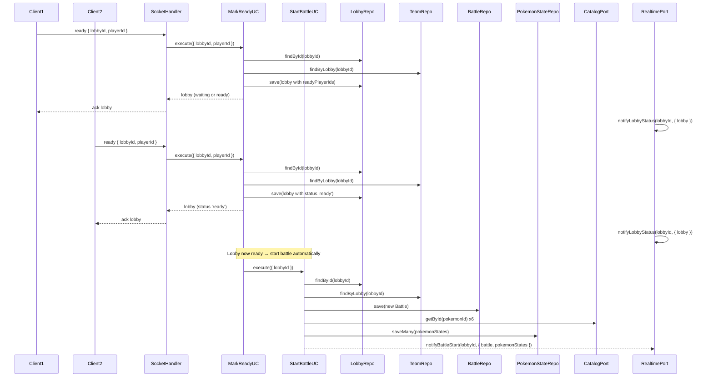
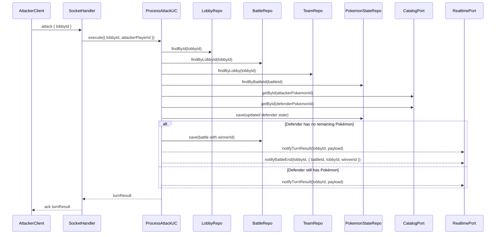

# Stage 6 — Battle: Turns, Damage, and Game End (Detailed Specification)

This document details what must be built in **Stage 6** of the PokePVP phased plan. It expands on [phased-plan.md](phased-plan.md) and aligns with [architecture.md](architecture.md) and [business-rules.md](business-rules.md). **Status:** ✅ Done.

---

## 1. Goal

Implement the **full battle flow** between two players who already passed through the lobby and team selection flow:

- Start a **battle** automatically from a lobby in `ready` state.
- Manage **turns**: first turn by Pokémon **Speed** (and a deterministic tiebreaker); subsequent turns alternate between players.
- Apply **damage** using the canonical formula, **defeat** Pokémon when HP reaches 0, and **auto-switch** to the next available Pokémon.
- Detect when a player has **no remaining Pokémon**, declare a **winner**, and mark the battle (and lobby) as **finished**.
- Persist battle and Pokémon state using existing repository ports, and **notify clients** in real time using `RealtimePort` and the Socket.IO adapter from Stage 5.

Key principles:

- All business rules for battle live in the **domain/application layer**, depending only on **ports** (repositories, catalog, realtime).
- **Express** and **Socket.IO** remain in the **infrastructure** layer as input/output adapters.
- Turn processing is **atomic**: the server must fully resolve a turn before the next attack is accepted.

---

## 2. Context and Previous Stages

Stage 6 builds on the following pieces delivered in earlier stages:

- **Stage 3 — Persistence**
  - Repository ports in `domain/ports/`:
    - `battle.repository.js` — `BattleRepository` for saving and loading battles.
    - `pokemon-state.repository.js` — `PokemonStateRepository` for per-Pokémon HP and defeated flag.
  - Entities in `domain/entities/`:
    - `battle.entity.js` — battle shape linked to `lobbyId`, with `winnerId` (optional).
    - `pokemon-state.entity.js` — `battleId`, `pokemonId`, `playerId`, `currentHp`, `defeated`.
  - MongoDB adapters for these ports under `infrastructure/persistence/mongodb/`.

- **Stage 4 — Lobby and Team Flow**
  - Lobby lifecycle and REST API in `lobby.controller.js`.
  - Use cases:
    - `JoinLobbyUseCase` — players join a lobby with `nickname`.
    - `AssignTeamUseCase` — assigns 3 random, non-overlapping Pokémon per player.
    - `MarkReadyUseCase` — marks players as ready and sets lobby `status` to `'ready'`.
  - Lobby entity extended with `readyPlayerIds`; lobby states from [business-rules.md](business-rules.md): `waiting`, `ready`, `battling`, `finished`.

- **Stage 5 — Socket.IO and Real-Time Events**
  - `RealtimePort` in `domain/ports/realtime.port.js` with:
    - `notifyLobbyStatus(lobbyId, payload)`.
    - `notifyBattleStart(lobbyId, payload)`.
    - `notifyTurnResult(lobbyId, payload)`.
    - `notifyBattleEnd(lobbyId, payload)`.
  - Socket.IO adapter in `infrastructure/socket/socketio.adapter.js` implementing `RealtimePort` and emitting:
    - `lobby_status`, `battle_start`, `turn_result`, `battle_end`.
  - Socket handler in `infrastructure/socket/socket.handler.js` that:
    - Handles `join_lobby`, `assign_pokemon`, `ready` using existing use cases.
    - Stubs `attack` with an `attack_not_available` error (to be implemented here).

Stage 6 does **not** introduce new ports; it adds **new use cases** that orchestrate these existing ports and completes the `attack` event flow.

---

## 3. Battle Domain Model

The battle model reuses entities defined in Stage 3 and the business rules in [business-rules.md](business-rules.md) §§4–6.

### 3.1 Battle Entity

**File:** `domain/entities/battle.entity.js`

Existing shape (from Stage 3):

- `id`
- `lobbyId`
- `startedAt` (optional)
- `winnerId` (optional; set when the battle ends)

Stage 6 extends this entity with:

- `nextToActPlayerId` (optional): the player who must perform the next attack. Set once at battle start (by Speed of initial actives) and updated after each attack (alternation: the player who did not attack becomes next to act).

The canonical lifecycle:

- When created, battle has `winnerId = null` and is linked to a lobby in `ready` state.
- When the match ends, `winnerId` is set to the winning player’s id and battle is considered **finished**.

### 3.2 Pokémon State Entity

**File:** `domain/entities/pokemon-state.entity.js`

Existing fields:

- `id` (optional)
- `battleId`
- `pokemonId` (catalog id)
- `playerId`
- `currentHp`
- `defeated` (boolean)

Stage 6 assumes:

- `currentHp` is initialized to the **full HP** value from the Pokémon catalog detail (`hp`).
- `defeated` is `false` when a battle starts, becomes `true` when `currentHp` reaches 0.

### 3.3 Active Pokémon and Turn State

Business rules from [business-rules.md](business-rules.md):

- Each player has 3 Pokémon.
- When a Pokémon is defeated and the player has another available Pokémon, the **next Pokémon automatically enters** the battle.

Stage 6 chooses a **simple, derived model** to avoid extra persistence:

- The **active Pokémon** for a player at any time is:
  - The first Pokémon in the player’s ordered team with `defeated === false`.
  - If all three are `defeated`, the player has no active Pokémon and loses the battle.
- **Turn order:** The **first turn** is assigned to the player whose initial active Pokémon has the higher Speed (with a deterministic tiebreaker: e.g. `playerId` lexicographically, then `pokemonId` numerically). **Subsequent turns** are strictly sequential: the next attacker is the other player (the one who did not attack last). The battle entity stores `nextToActPlayerId`; it is set at battle start and updated after each attack.

### 3.4 Damage and HP Rules

From [business-rules.md](business-rules.md) §5:

- **Formula:**
  - `Damage = Attacker Attack - Defender Defense`
- If result `< 1`, set damage to **1** (minimum damage).
- HP update:
  - `Defender Current HP = Defender Current HP - Damage`
- HP shall **never** drop below `0`.

When `currentHp` reaches `0`:

- `defeated` for that Pokémon becomes `true`.
- If the owner player has at least one non-defeated Pokémon left, the **next Pokémon automatically enters**.
- If not, the battle **ends** and the attacker’s player is the **winner**.

---

## 4. New Battle Use Cases

Stage 6 introduces two main use cases in `application/use-cases/`:

- `StartBattleUseCase` — initializes a battle from a lobby in `ready` state.
- `ProcessAttackUseCase` — processes an attack turn, updates HP/defeat, and declares a winner when applicable.

### 4.1 StartBattleUseCase

**File:** `application/use-cases/start-battle.use-case.js`

**Purpose:** Create and initialize a battle when a lobby reaches `ready` state.

**Dependencies (injected):**

- `lobbyRepository` — to load and update lobby status.
- `teamRepository` — to get each player’s assigned Pokémon (`pokemonIds`).
- `battleRepository` — to create and load `Battle`.
- `pokemonStateRepository` — to initialize per-Pokémon state.
- `catalogPort` — to obtain Pokémon HP from the external catalog.
- `realtimePort` — to notify clients via `notifyBattleStart`.

**Input:**

```ts
{
  lobbyId: string;
}
```

**Flow:**

1. Load lobby by id via `lobbyRepository.findById(lobbyId)`:
   - If not found, throw `NotFoundError`.
2. Validate lobby status:
   - If `status !== 'ready'`, throw `ConflictError` (cannot start battle from non-ready lobby).
3. Load teams for this lobby via `teamRepository.findByLobby(lobbyId)`:
   - Expected: exactly 2 players with teams of 3 Pokémon each.
   - If any team missing or invalid (e.g. wrong size), throw `ValidationError`.
4. Check if a battle already exists:
   - `battleRepository.findByLobbyId(lobbyId)`.
   - If a battle already exists and is not finished, either:
     - Return the existing battle and states (idempotent), or
     - Throw `ConflictError` if duplicate start is considered invalid.
   - Recommended: **idempotent** behaviour — reuse existing battle and return it.
5. Create a new `Battle` entity:
   - `lobbyId`, `startedAt = now`, `winnerId = null`.
   - Determine **first player to act**: fetch catalog detail for each team's first (initial active) Pokémon; compare Speed (with deterministic tiebreaker: playerId, then pokemonId). Set `nextToActPlayerId` to that player's id.
   - Save via `battleRepository.save(battle)` (including `nextToActPlayerId`).
6. For each team:
   - For each `pokemonId` in team `pokemonIds`:
     - Fetch catalog detail via `catalogPort.getById(pokemonId)` to get `hp` (and optionally `attack`, `defense`, `speed` for caching).
     - Create `PokemonState`:
       - `battleId`: created battle id.
       - `pokemonId`: same as team id.
       - `playerId`: owner player id.
       - `currentHp`: catalog `hp`.
       - `defeated`: `false`.
   - Collect all states in an array.
7. Persist states in bulk via `pokemonStateRepository.saveMany(states)`.
8. Optionally update lobby status to `'battling'` and save lobby.
9. Build a payload for `RealtimePort.notifyBattleStart(lobbyId, payload)`:
   - Suggested shape:
     ```json
     {
       "battle": { "id", "lobbyId", "winnerId": null },
       "pokemonStates": [
         { "playerId", "pokemonId", "currentHp", "defeated" }
       ]
     }
     ```
   - Clients can compute actives as “first non-defeated per player”.
10. Call `realtimePort.notifyBattleStart(lobbyId, payload)`.

**Output:**

- Returns an object such as:
  ```ts
  {
    battle: Battle;
    pokemonStates: PokemonState[];
  }
  ```

**Errors:**

- `NotFoundError` — lobby not found.
- `ConflictError` — lobby not in `ready`, invalid teams, or duplicate active battle (depending on idempotency decision).
- `ValidationError` — invalid lobby/teams, missing catalog data.

### 4.2 ProcessAttackUseCase

**File:** `application/use-cases/process-attack.use-case.js`

**Purpose:** Process a single attack turn, update HP and defeat state, and declare battle end when a player has no remaining Pokémon.

**Dependencies (injected):**

- `lobbyRepository` — to validate lobby and its status (`battling`).
- `teamRepository` — to know team composition/order per player.
- `battleRepository` — to load and update battle.
- `pokemonStateRepository` — to load and update Pokémon states.
- `catalogPort` — to obtain Pokémon stats (`attack`, `defense`, `speed`) as needed.
- `realtimePort` — to notify `turn_result` and, when applicable, `battle_end`.

**Input:**

Minimal recommended shape (attached to `attack` Socket.IO event):

```ts
{
  lobbyId: string;
  attackerPlayerId: string;
  defenderPlayerId: string;
  attackerPokemonId?: number; // optional if always using active
  defenderPokemonId?: number; // optional if always using active
}
```

Implementation may choose to:

- Ignore `attackerPokemonId`/`defenderPokemonId` and always use **current active Pokémon** derived from state + team order.
- Or accept them and validate that they match the current actives.

**Flow:**

1. **Validate lobby and battle:**
   - Load lobby via `lobbyRepository.findById(lobbyId)`:
     - If not found, throw `NotFoundError`.
   - Validate lobby `status`:
     - If not `battling`, throw `ConflictError` (battle not started or already ended).
   - Load battle via `battleRepository.findByLobbyId(lobbyId)`:
     - If not found, throw `NotFoundError` (StartBattle not executed).
   - If `battle.winnerId` is already set, throw `ConflictError` (battle already finished).

2. **Load teams and derive active Pokémon:**
   - Load teams via `teamRepository.findByLobby(lobbyId)`.
   - From teams, determine:
     - List of `pokemonIds` per player in the original order.
   - Load all `PokemonState` via `pokemonStateRepository.findByBattleId(battle.id)`.
   - For each player:
     - Compute **active Pokémon** as first `pokemonId` in that player’s ordered list whose state has `defeated === false`.
     - If no such Pokémon exists for the **attacker player**, throw `ConflictError` (attacker has no available Pokémon; battle should already be ended).
     - If no available Pokémon for the **defender player**, the attacker already won — set `winnerId` and return early (or treat as conflict).

3. **Validate turn:**
   - Check that the requesting player is the one who must act: `battle.nextToActPlayerId === requestingPlayerId` (the "attacker" in the event).
   - If not, throw `ConflictError` (not this player's turn).
   - Fetch catalog detail for both active Pokémon via `catalogPort.getById(pokemonId)` to read `attack`, `defense` (Speed is not used here; turn order comes from `nextToActPlayerId`).

4. **Apply the attack:**
   - Stage 6 can implement **one action per attack event** (the event describes which side is making the move). To keep the spec simple and aligned with the client event `attack` (“the player’s active Pokémon attacks the rival”), use this approach:
     - **Only the requesting player attacks** in this event.
   - Flow:
     1. Determine the **real attacker** for this event:
        - If the requesting player has the faster active Pokémon, proceed.
        - Otherwise, the event is **invalid** (player is trying to attack out of turn); throw `ConflictError` (not this player’s turn).
     2. Use stats for attacker’s active Pokémon and defender’s active Pokémon:
   - `damage = max(1, attacker.attack - defender.defense)`.
   - Reduce defender state `currentHp` by `damage` but not below `0`.
   - If `currentHp` becomes `0`, mark `defeated = true`.
   - Persist updated defender state via `pokemonStateRepository.save(state)` (or a small batch).
   - Update battle turn: set `battle.nextToActPlayerId` to the defender's `playerId` (the player who did not attack; they will act next). Save battle via `battleRepository.save(battle)`. If the battle ends this turn (defender has no remaining Pokémon), skip this update or leave `nextToActPlayerId` unchanged.

5. **Check defeat and auto-switch:**
   - After applying damage:
     - If defender’s active Pokémon is `defeated`:
       - Check if defender has another non-defeated Pokémon in their ordered team:
         - If yes, that next Pokémon becomes the new active (derived, no extra write needed).
         - If no, defender has **no remaining Pokémon**:
           - Set `battle.winnerId = attackerPlayerId`.
           - Save battle via `battleRepository.save(battle)`.
           - Optionally update lobby `status` to `'finished'` and save lobby.

6. **Build result payload and emit events:**
   - Build a `turn_result` payload such as:
     ```json
     {
       "battleId": "<battle_id>",
       "lobbyId": "<lobby_id>",
       "attacker": {
         "playerId": "<attacker_id>",
         "pokemonId": <attacker_pokemon_id>
       },
       "defender": {
         "playerId": "<defender_id>",
         "pokemonId": <defender_pokemon_id_before>,
         "damage": <applied_damage>,
         "previousHp": <hp_before>,
         "currentHp": <hp_after>,
         "defeated": true | false
       },
       "nextActivePokemon": {
         "playerId": "<player_who_switched>",
         "pokemonId": <new_active_pokemon_id> | null
       },
       "battleFinished": true | false
     }
     ```
   - Always call:
     - `realtimePort.notifyTurnResult(lobbyId, payload)`.
   - If `battleFinished` is `true`:
     - Build `battle_end` payload, e.g.:
       ```json
       {
         "battleId": "<battle_id>",
         "lobbyId": "<lobby_id>",
         "winnerId": "<winner_player_id>"
       }
       ```
     - Call `realtimePort.notifyBattleEnd(lobbyId, payload)`.

7. **Output:**

- Return same structure as `turn_result` payload (or an enriched object), to be used by HTTP or by Socket.IO handler acknowledgements.

**Errors:**

- `NotFoundError` — lobby or battle not found.
- `ValidationError` — malformed input (missing ids, wrong players).
- `ConflictError` — lobby not in `battling`, battle already finished, attacker has no available Pokémon, or not this player’s turn.

**Atomicity note:**

- At JavaScript level, the use case should:
  - Load states.
  - Apply pure in-memory calculations.
  - Persist updates for states and battle (if ended) **before** emitting realtime events.
  - Exceptions during persistence should prevent any realtime emission.

---

## 5. Integration with Existing Ports and Repositories

Stage 6 reuses all existing ports; no new ports are introduced.

### 5.1 BattleRepository

**File:** `domain/ports/battle.repository.js`

Methods used by Stage 6:

- `save(battle)` → `Promise<Battle>` — create or update battle.
- `findById(id)` → `Promise<Battle | null>` — optional, for direct lookup.
- `findByLobbyId(lobbyId)` → `Promise<Battle | null>` — load battle by lobby.

The MongoDB adapter must:

- Allow searching by `lobbyId` (index as defined in Stage 3).
- Persist `winnerId` and any optional fields added (e.g. `status`).

### 5.2 PokemonStateRepository

**File:** `domain/ports/pokemon-state.repository.js`

Methods used by Stage 6:

- `save(state)` → `Promise<PokemonState>` — update a single Pokémon’s state (mainly during attacks).
- `saveMany(states)` → `Promise<PokemonState[]>` — bulk initialization when a battle starts.
- `findByBattleId(battleId)` → `Promise<PokemonState[]>` — load all states for computing active Pokémon and remaining teams.

Implementation must:

- Ensure `findByBattleId` returns all states for a battle.
- Support efficient updates (indexes per Stage 3).

### 5.3 TeamRepository

**File:** `domain/ports/team.repository.js`

Methods used:

- `findByLobby(lobbyId)` → `Promise<Team[]>` — to derive:
  - Team composition per player.
  - Order of Pokémon for automatic next entry.

### 5.4 LobbyRepository

**File:** `domain/ports/lobby.repository.js`

Methods used:

- `findById(id)` → `Promise<Lobby | null>` — to validate lobby state before battle start and attacks.
- `save(lobby)` → `Promise<Lobby>` — optional; used to:
  - Transition from `ready` → `battling` in `StartBattleUseCase`.
  - Transition from `battling` → `finished` when the battle ends.

### 5.5 CatalogPort

**File:** `domain/ports/catalog.port.js`

Methods used:

- `getById(id)` → `Promise<PokemonDetail>` — to:
  - Initialize `currentHp` in `StartBattleUseCase`.
  - Obtain `attack`, `defense`, `speed` during `ProcessAttackUseCase`.

Implementation may **cache** catalog details in memory during a match to avoid redundant HTTP calls, but this is an optimization, not a requirement of Stage 6.

### 5.6 RealtimePort

**File:** `domain/ports/realtime.port.js`

Methods used:

- `notifyBattleStart(lobbyId, payload)` — when `StartBattleUseCase` finishes successfully.
- `notifyTurnResult(lobbyId, payload)` — after each processed attack.
- `notifyBattleEnd(lobbyId, payload)` — when a winner is declared.

The existing Socket.IO adapter from Stage 5 maps these to the corresponding Socket.IO events.

---

## 6. Socket.IO Events and RealtimePort Usage in Stage 6

Stage 6 connects the new battle use cases with the real-time events defined in [business-rules.md](business-rules.md) §7 and `stage-5-spec.md`.

### 6.1 Event Mapping

| Use Case              | RealtimePort call                         | Socket.IO event    | Purpose |
|-----------------------|-------------------------------------------|--------------------|---------|
| `StartBattleUseCase`  | `notifyBattleStart(lobbyId, payload)`     | `battle_start`     | Signal that the battle officially starts; send initial state. |
| `ProcessAttackUseCase`| `notifyTurnResult(lobbyId, payload)`      | `turn_result`      | Inform clients about damage, HP changes, defeat, and auto-switch. |
| `ProcessAttackUseCase`| `notifyBattleEnd(lobbyId, payload)`       | `battle_end`       | Inform clients that the battle finished and who the winner is. |

### 6.2 Payload Contracts (Minimum)

These payloads are **minimum suggestions**; the implementation may extend them with extra fields as needed by the frontend.

**`battle_start` payload:**

```json
{
  "battle": {
    "id": "<battle_id>",
    "lobbyId": "<lobby_id>",
    "winnerId": null
  },
  "pokemonStates": [
    {
      "playerId": "<player_id>",
      "pokemonId": 1,
      "currentHp": 45,
      "defeated": false
    }
  ]
}
```

**`turn_result` payload:**

```json
{
  "battleId": "<battle_id>",
  "lobbyId": "<lobby_id>",
  "attacker": {
    "playerId": "<attacker_id>",
    "pokemonId": 1
  },
  "defender": {
    "playerId": "<defender_id>",
    "pokemonId": 4,
    "damage": 12,
    "previousHp": 30,
    "currentHp": 18,
    "defeated": false
  },
  "nextActivePokemon": {
    "playerId": "<player_who_switched>",
    "pokemonId": 5
  },
  "battleFinished": false
}
```

If there is no new active Pokémon (defender still has HP), `nextActivePokemon.pokemonId` may be `null` or the field omitted.

**`battle_end` payload:**

```json
{
  "battleId": "<battle_id>",
  "lobbyId": "<lobby_id>",
  "winnerId": "<winner_player_id>"
}
```

---

## 7. Infrastructure Changes (Socket Handler and Wiring)

Stage 6 requires changes only at the input adapter and wiring level; ports and adapters remain the same.

### 7.1 Socket Handler (`socket.handler.js`)

**File:** `infrastructure/socket/socket.handler.js`

Extend the existing handler to support the full `attack` event:

- **Dependencies (constructor):**
  - `joinLobbyUseCase` (existing).
  - `assignTeamUseCase` (existing).
  - `markReadyUseCase` (existing).
  - `startBattleUseCase` (NEW, optional wiring).
  - `processAttackUseCase` (NEW).
  - `realtimePort` (Socket.IO adapter).
  - `lobbyRepository` (existing).

- **Event handler for `attack`:**
  - **Payload from client:**
    - At minimum: `{ lobbyId }`.
    - Recommended: no player id in payload; derive attacker from `socket.data.playerId` to avoid spoofing.
  - **Flow:**
    1. Extract `lobbyId` from payload and `attackerPlayerId` from `socket.data.playerId`.
    2. Validate that `socket.data.lobbyId` matches payload `lobbyId`; otherwise throw `ValidationError`.
    3. Call `processAttackUseCase.execute({ lobbyId, attackerPlayerId, defenderPlayerId })`:
       - `defenderPlayerId` may be derived from lobby `playerIds` (the other player).
    4. On success:
       - Acknowledge to the caller with the returned `turn_result` structure.
       - The use case itself already emitted `turn_result` / `battle_end` via `RealtimePort`.
    5. On error:
       - Emit `error` event with `{ code, message }` and/or send error via ack.

- **Triggering `StartBattleUseCase`:**
  - When both players are **ready**, lobby status becomes `'ready'` as in Stage 4.
  - Stage 6 must define when `StartBattleUseCase` runs:
    - Option A (recommended): **immediately after both players are ready**, inside `MarkReadyUseCase` or its caller:
      - When `MarkReadyUseCase` transitions lobby to `ready`, call `StartBattleUseCase` to:
        - Create `Battle`, initialize Pokémon states, set lobby to `battling`, and emit `battle_start`.
    - Option B: a dedicated event or endpoint (e.g. client triggers `start_battle`); this is optional and not necessary per business rules (which state that battle starts automatically).
  - The spec for Stage 6 assumes **Option A** to align with the rule “battle shall start automatically when both players are in the ready state”.

### 7.2 App and Index Wiring

- **`app.js`:**
  - Continue to wire REST controllers (catalog, lobby) as in previous stages.
  - No direct change required for Stage 6 except:
    - Optionally construct and inject `StartBattleUseCase` into the dependency graph if it is triggered from a REST path.

- **`index.js`:**
  - Already creates the HTTP server and Socket.IO instance and wires the Socket handler.
  - Extend wiring to:
    - Instantiate `StartBattleUseCase` and `ProcessAttackUseCase` with:
      - `lobbyRepository`, `teamRepository`, `battleRepository`, `pokemonStateRepository`, `catalogPort`, `realtimePort`.
    - Provide these use cases to `SocketHandler` so it can:
      - Trigger `StartBattleUseCase` when needed (if using Option A inside Socket layer).
      - Handle `attack` via `ProcessAttackUseCase`.

No new environment variables are required in Stage 6.

---

## 8. Data Flow and Sequence Diagrams

### 8.1 Battle Start (Lobby Ready → Battle Start)



### 8.2 Attack Turn (Socket.IO `attack` → Turn Result)



---

## 9. Implementation Checklist

- [ ] **StartBattleUseCase**
  - [ ] Create `application/use-cases/start-battle.use-case.js`.
  - [ ] Inject `lobbyRepository`, `teamRepository`, `battleRepository`, `pokemonStateRepository`, `catalogPort`, `realtimePort`.
  - [ ] Implement flow to validate lobby in `ready`, create/reuse battle, initialize `PokemonState` with full HP, optionally set lobby `status` to `'battling'`, and call `notifyBattleStart`.
  - [ ] Add unit tests: missing lobby, lobby not `ready`, successful initialization, idempotent behaviour.

- [ ] **ProcessAttackUseCase**
  - [ ] Create `application/use-cases/process-attack.use-case.js`.
  - [ ] Inject `lobbyRepository`, `teamRepository`, `battleRepository`, `pokemonStateRepository`, `catalogPort`, `realtimePort`.
  - [ ] Implement flow: validate lobby/battle, derive active Pokémon, enforce turn ordering by Speed, apply damage, update HP and defeat, auto-switch, declare winner, and emit `turn_result`/`battle_end`.
  - [ ] Add unit tests for: normal hit, minimum damage, defeat with auto next Pokémon, and battle end when no remaining Pokémon.

- [ ] **Socket handler and wiring**
  - [ ] Update `infrastructure/socket/socket.handler.js` to wire `attack` to `ProcessAttackUseCase` (using `socket.data.playerId` and lobby id).
  - [ ] Ensure `socket.handler.js` triggers `StartBattleUseCase` (directly or indirectly) when lobby transitions to `ready`, if not already triggered from the REST path.
  - [ ] Update wiring in `index.js` (and/or `app.js`) to instantiate and inject `StartBattleUseCase` and `ProcessAttackUseCase` into `SocketHandler`.

- [ ] **Realtime integration**
  - [ ] Ensure `StartBattleUseCase` calls `realtimePort.notifyBattleStart` with payload containing `battle` and `pokemonStates`.
  - [ ] Ensure `ProcessAttackUseCase` calls `realtimePort.notifyTurnResult` on every successful attack.
  - [ ] Ensure `ProcessAttackUseCase` calls `realtimePort.notifyBattleEnd` when a battle ends.

- [ ] **End-to-end verification**
  - [ ] Extend `socketio-test-flow.md` (or create new tests) to cover: battle start after both players ready, attack events updating HP, auto-switching Pokémon, and battle end.
  - [ ] Run full test suite (unit + integration) to verify no regressions in previous stages.

---

## 10. Success Criteria and References

### Success Criteria

1. A battle **starts automatically** when both players are ready, creating a `Battle` linked to the lobby and initializing `PokemonState` for all 6 Pokémon with full HP.
2. Each `attack` event from the current-turn player:
   - Processes exactly one attack atomically.
   - Applies damage based on the canonical formula and **never** lets HP drop below 0.
   - Automatically defeats Pokémon at 0 HP and switches to the next one if available.
3. When a player has no remaining Pokémon, the battle:
   - Sets `winnerId` in `Battle`.
   - Transitions lobby (and optionally battle) to `finished`.
   - Emits a `battle_end` event with at least `battleId`, `lobbyId`, and `winnerId`.
4. All battle state (Battle and PokemonState) persists correctly in MongoDB and remains consistent between REST and Socket.IO flows.

### References

- [phased-plan.md](phased-plan.md) — Stage 6 summary.
- [architecture.md](architecture.md) — Hexagonal architecture, ports, and adapters.
- [business-rules.md](business-rules.md) — §4 Battle flow, §5 Damage and HP, §6 Defeat and battle end, §7 Events.
- [stage-3-spec.md](stage-3-spec.md) — Repository ports, entities, MongoDB adapters.
- [stage-4-spec.md](stage-4-spec.md) — Lobby and team use cases, REST API.
- [stage-5-spec.md](stage-5-spec.md) — Realtime port, Socket.IO adapter and handler, events.

